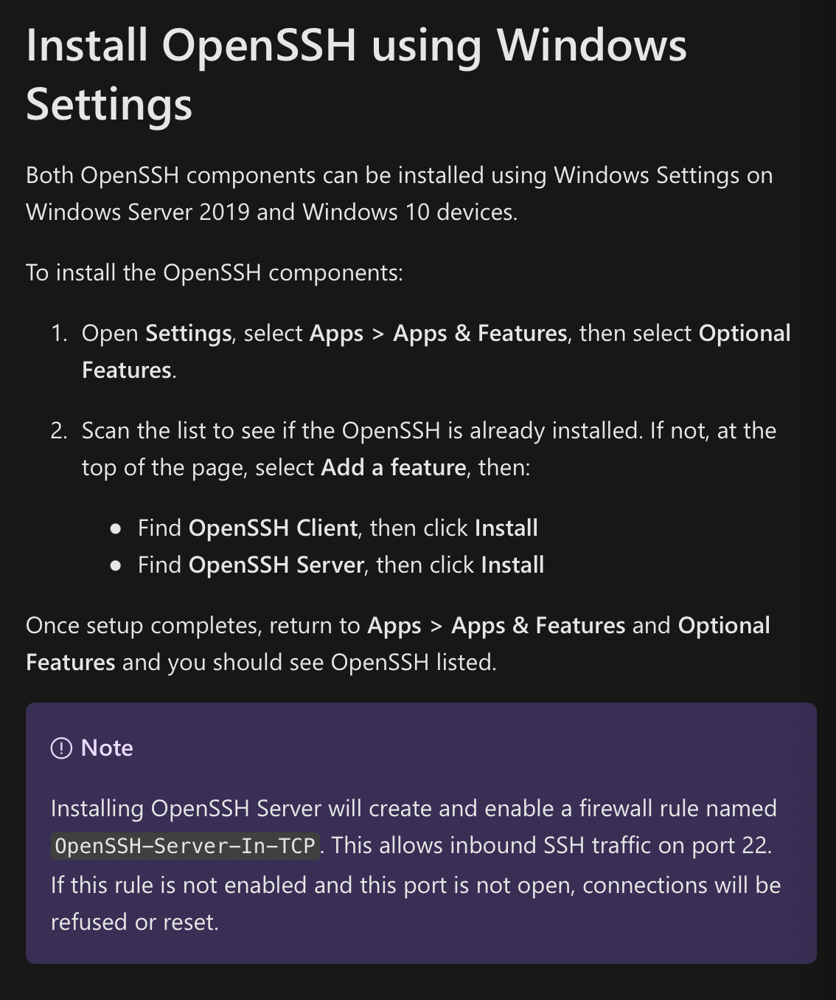

# Week 2 Lab Report

## How to log into a course-specific account on `ieng6`:

## 1. Installing *VSCode*
* Go to the [Visual Studio Code Website](https://code.visualstudio.com/).
* Click the down arrow to see all of the available versions.

* Choose the stable download link next to the operating system you'll be using.

## 2. Remotely Connecting
* **EXTRA STEP FOR WINDOWS:** Install OpenSSH by following the instructions [here](https://docs.microsoft.com/en-us/windows-server/administration/openssh/openssh_install_firstuse).

* Look up your course-specific `ieng6` account [here](https://sdacs.ucsd.edu/~icc/index.php). The account will look something like `cs15lwi22[zz]` but with the `[zz]` part containing a unique string of letters.
* In *VSCode* open a terminal and input the command `$ ssh cs15lwi22[zz]@ieng6.ucsd.edu`.

* If this is the first time connecting to the server, you will get a message asking if you are sure you want to continue. Type `yes` and press enter.
## 3. Trying Some Commands
* Try inputting the commands `cd`, `ls`, `pwd`, `mkrid`, and `cp` to see what they do on your computer and the remote computer.

* Some useful commands include `ls` which lists files and folders, `cd` which changes the current directory, and `cp` which can copy files and folders.
* To log out of the remote server, you can input `exit` into the terminal.
## 4. Moving Files with `scp`
* To move files from your computer to a remote computer, you can use the `scp` command.
* In the terminal from the directory of the file you want to copy, run the command `scp [filename] cs15lwi22[zz]@ieng6.ucsd.edu:~/` where `[filename]` is the name of the file you want to copy.
* You will be prompted to input your password just like when you log in with the `ssh` command. After that, if you log into the remote computer you should be able to see your file.

## 5. Setting an SSH Key
It can be very tedious to input your password after using the `ssh` or `scp` command. Fortunately, there is a way to make this process faster.
* Input the command `ssh-keygen` to generate a public key to copy to the remote computer and a private key on your computer. **Note:** Don't use a passphrase to prevent having to input a password every time you use a `ssh` or `scp` command.

* **EXTRA STEP FOR WINDOWS:** follow the instructions [here](https://docs.microsoft.com/en-us/windows-server/administration/openssh/openssh_keymanagement#user-key-generation)
* To copy the *public* key to the remote computer, log into the server and input the command `$ mkdir .ssh` then log out.

* Once you're back on your own computer, input the command `$ scp [keypath] cs15lwi22[zz]@ieng6.ucsd.edu:~/.ssh/authorized_keys` where [keypath] is the path in which the keys were saved after using the `ssh-keygen` command.

## 6. Optimizing Remote Running

There are many useful tricks you can use to make running on a remote server more efficient

* Using the up-arrow on the keyboard can recall previous commands made in the terminal
* Using quotes at the end of an `ssh` command can run the command on the remote server then log out without you having to log in first.

* Using semicolons can allow you to run multiple commands on the same line without having to input them one at a time.

That's it, now you know how to access your course-specific account on `ieng6`