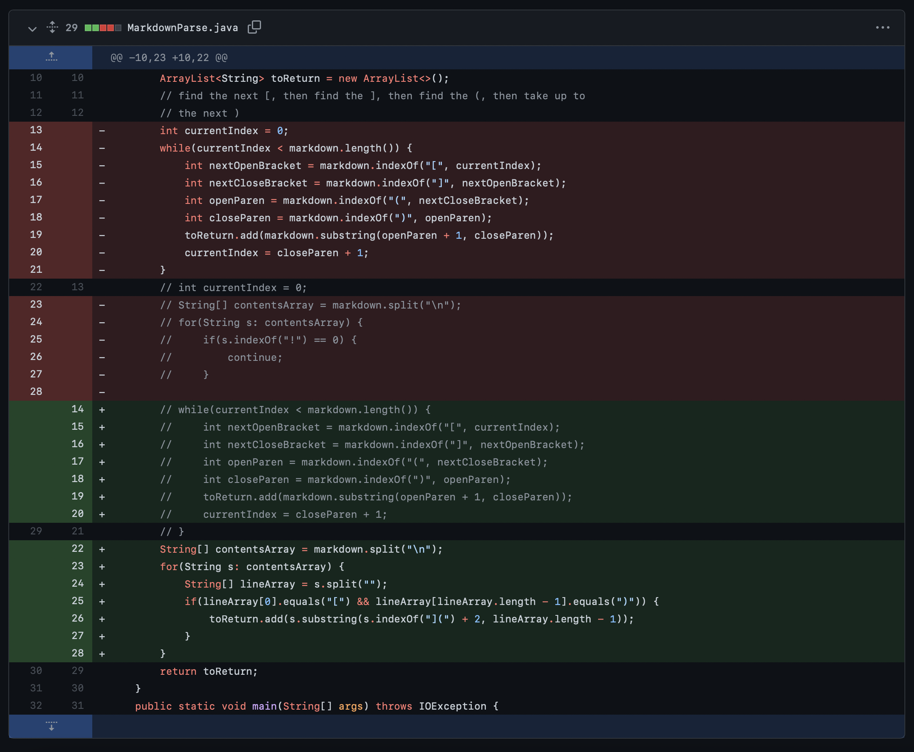
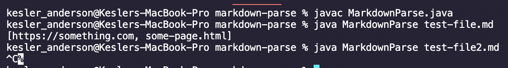
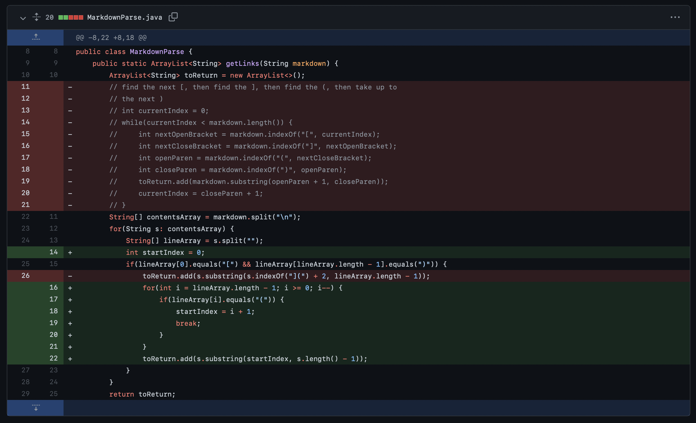
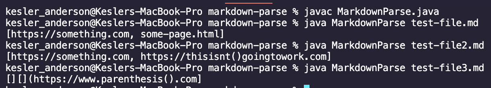
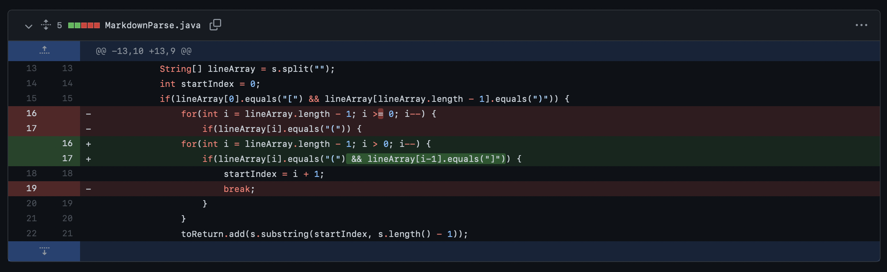
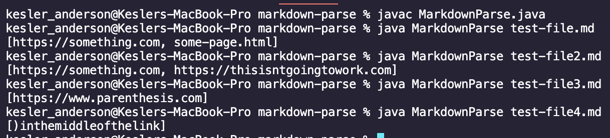

# Week 4 Lab Report

## Code Change #1
### Screenshot of the code change difference: 

### Link to the failure-inducing input: 
[test-file2.md](https://github.com/kjanderson1/markdown-parse/raw/main/test-file2.md)

### Screenshot of the symptom of the failure-inducing input:

### Relationship between the bug, the symptom, and the failure-inducing input: 
The original version of `MarkdownParse.java` included a bug that could cause an infinite loop if there was a pair of parenthesis in a line. The failure-inducing input had `()` in the middle of the brackets before the link to induce the bug. As a result, the symptom was an infinite loop that had to be interrupted at the command line by the "control+c" shortcut.

---

## Code Change #2
### Screenshot of the code change difference:

### Link to the failure-inducing input: 
[test-file3.md](https://github.com/kjanderson1/markdown-parse/raw/main/test-file3.md)

### Screenshot of the symptom of the failure-inducing input:

### Relationship between the bug, the symptom, and the failure-inducing input:
The second version of `MarkdownParse.java` now had a bug where the link would start after the first occurence of `](`. The failure-inducing input included a link that had `](` in the text within the brackets before the link to induce the bug. As a result, the symptom was that all the text after `](` was included in the output.

---
## Code Change #3
### Screenshot of the code change difference:

### Link to the failure-inducing input:
[test-file4.md](https://github.com/kjanderson1/markdown-parse/raw/main/test-file4.md)

### Screenshot of the symptom of the failure-inducing input:

### Relationship between the bug, the symptom, and the failure-inducing input:
The third version of `MarkdownParse.java` now had a bug where the link would start after the last occurence of `(`. The failure-inducing input included `(` in the middle of the link. As a result, the symptom was that only part of the link was included in the output.