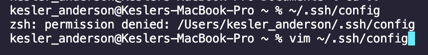
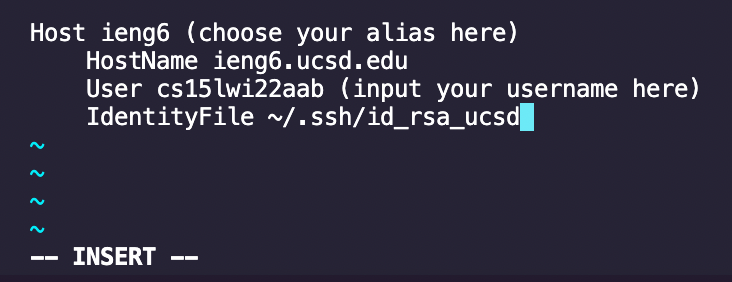
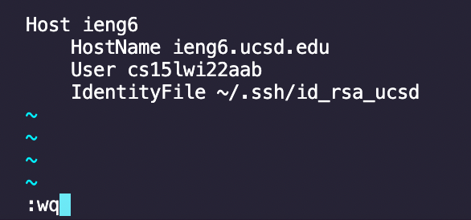
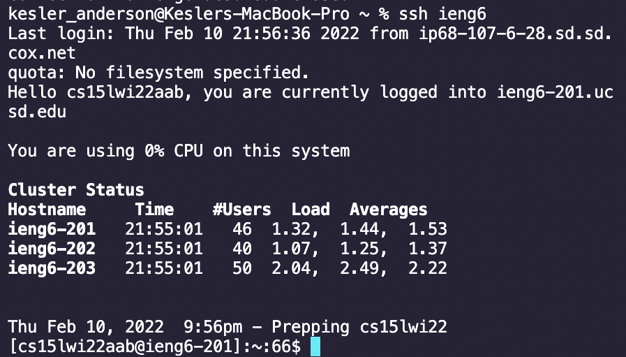
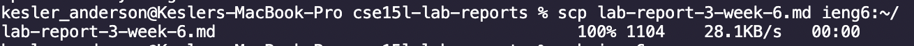
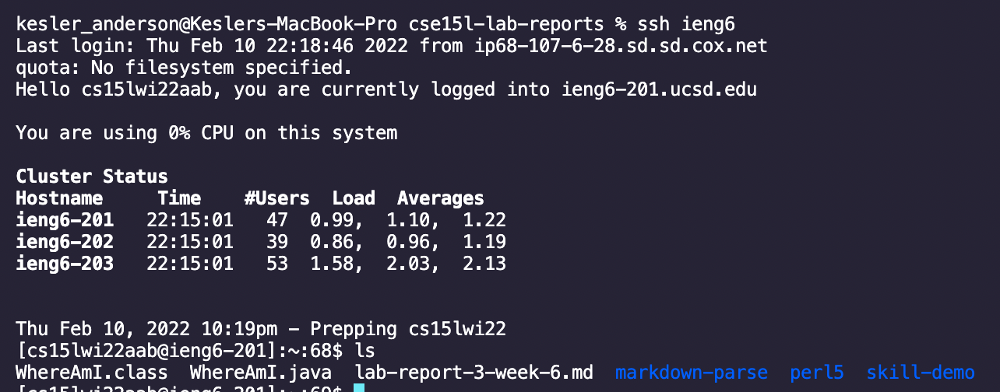

# Week 6 Lab Report

## Streamlining `ssh` Configuration

### **Step 1: Creating a `.ssh/config` file**

* Enter in the command `~/.ssh/config` into the terminal (in the examples below I will be using the terminal in VSCode). **If you get a message saying permission denied:** try using the command `vim ~/.ssh/config`.

* Press the `I` key to edit the contents of the `.ssh/config` file and insert the following into the file:

* **Note:** The `IdentityFile` line should only be added if you are unable to complete Step 2.
* Once you're done editing the file, press `esc` to stop editing and enter `:wq` to save your changes and exit.

### **Step 2: Logging in using the `ssh` command with your chosen alias**
* In the terminal, input the command `ssh (your alias here)` to log into your `ieng6` account.

* If this did not work, refer back to the note in Step 1.

### **Step 3: Copying a file using `scp` with your chosen alias**
* Now that you are able to log into your `ieng6` account, try using the `scp` command with just your alias.

* Log into your account once more and use the `ls` command to verify that the file is there.

* You have now successfully streamlined `ssh` configuration.