# Week 8 Lab Report

## Snippet 1:
* What the test *should* produce:
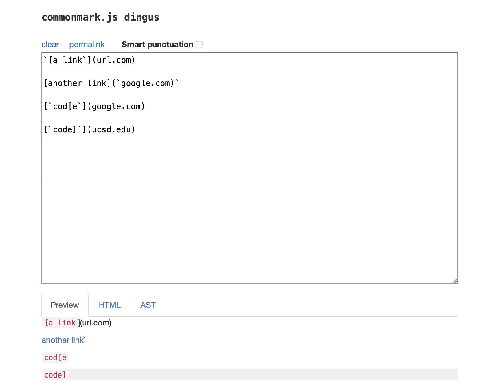

* Test in `MarkdownParseTest.java`:
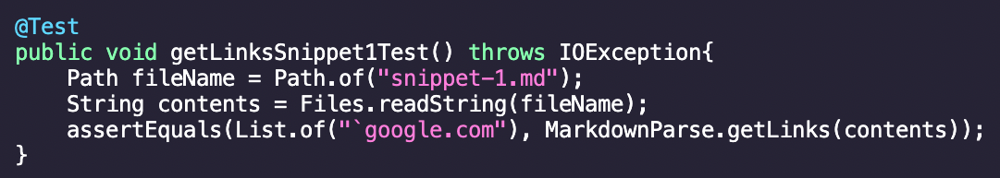

* Output for the test in my implementation (did not pass):
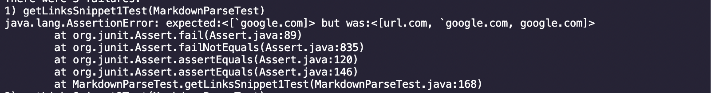

* Output for the test in the implementation I reviewed (did not pass):
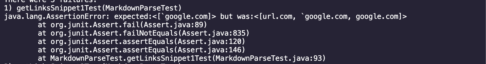

### Snippet 1 Fixes for my Implementation:
I think that there is a small code change that will make my program work for snippet 1 and all related cases that use inline code with backticks. In this small code change, I could add if statements that check if the brackets marking the start of a link are being turned into code by backticks. For example, I could check if there is a backtick before the index of open bracket and another before the index of close bracket so the links that are after the brackets are not added to the output.

## Snippet 2:
* What the test *should* produce:
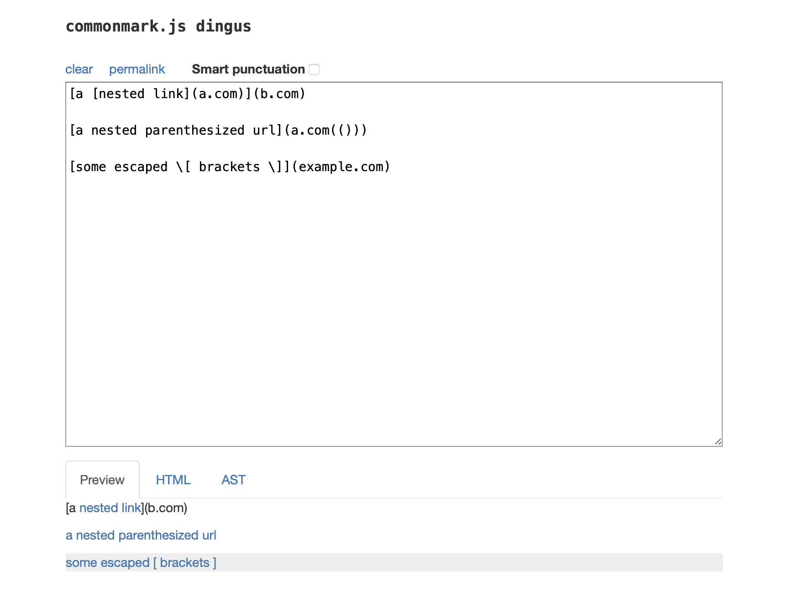

* Test in `MarkdownParseTest.java`:
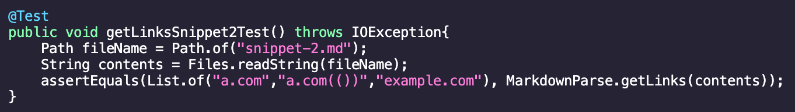

* Output for the test in my implementation (did not pass):
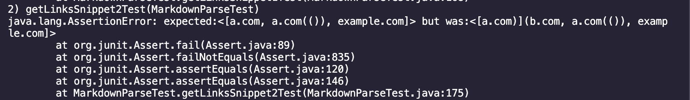

* Output for the test in the implementation I reviewed (did not pass):
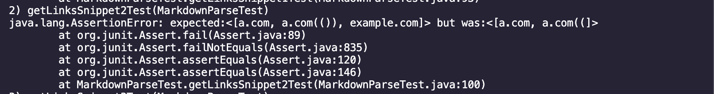

### Snippet 2 Fixes for my Implementation:
I think that there is a small code change that will make my program work for snippet 2 and all related cases that nest parentheses, brackets, and escaped brackets. In the small code change, I could add lines that check for nested links by looking for links within the index of the first occurence of `[` and the last occurence of `]` and add a `continue` in the for loop if a nested link is found so any link after doesn't get added. The program already checks for nested parenthesis and escaped brackets so this would be the only change that needs to be made.

## Snippet 3:
* What the test *should* produce:
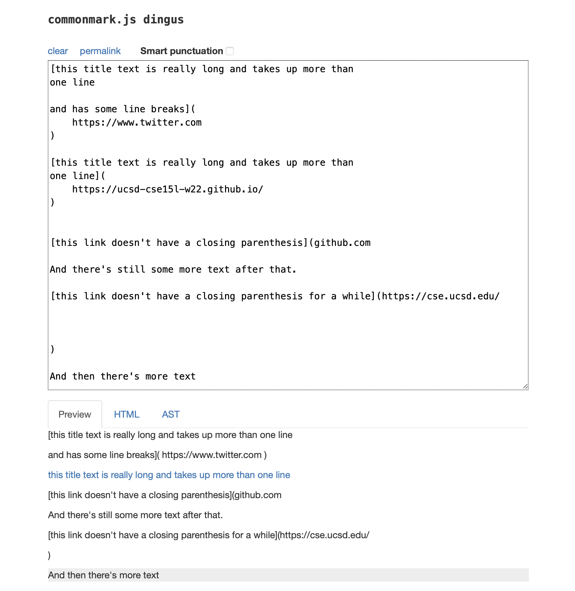

* Test in `MarkdownParseTest.java`:
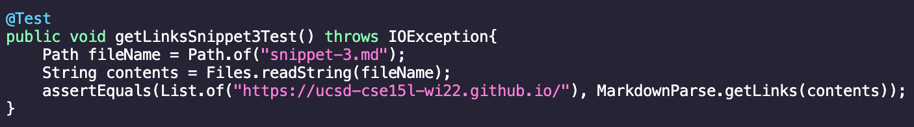

* Output for the test in my implementation (did not pass):
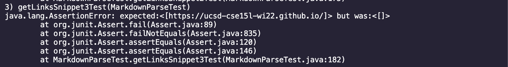

* Output for the test in the implementation I reviewed (did not pass):
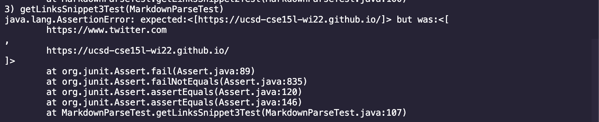

### Snippet 3 Fixes for my Implementation:
I do not think that there is a small code change that will make my program work for snippet 3 and all related cases that have newlines in brackets and parentheses. The program was created with the assumption that each link in the markdown file will be on a single line. Currently, the program turns the file into a string array containing each line of the file, so, the program would have to be adjusted to turn the file into a single string and have all the if statements and for loops changed to reflect this adjustment.