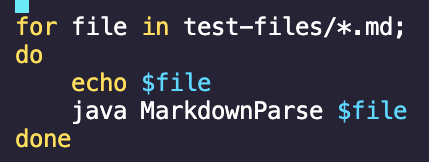

# Week 10 Lab Report

## Comparing `markdown-parse` Implementations Using `commonmark-spec` Tests:

### Links to the repositories I compared:
* [Provided repository](https://github.com/ucsd-cse15l-w22/markdown-parse.git)
* [My repository](https://github.com/kjanderson1/markdown-parse.git)

### How I found the tests with different results:
Step 1: Use a script to generate the ouput from each implementation and prints the name of each test file.
* What the script file looked like:

Step 2: Put the output into a `results.txt` file using output redirection.
* `results.txt` for the provided implementation:

* `results.txt` for my implementation:

Step 3: Use a program called `diff  ` to see the differences between the `results.txt` files.
* Some of the differences found by `diff`:

Step 4: Look for the test files that showed different outputs in `diff` by looking at the lines in the `results.txt` files highlighted by `diff`.
* Example difference in `diff` (line 872):

* Line 872 in `my-results.txt` (corresponds to test file `491.md`):

* Contents of test `491.md`:

### Two differences that correspond to different bugs:
Test 1: Test file 577.md
* Difference in `diff` (provided output at the top and my output at the bottom):

* Test file at line 1062:

* Contents of test file 577.md:

* If the test should be considered a link according to [the CommonMark demo site](https://spec.commonmark.org/dingus/):

According to the CommonMark demo site, the test should not be considered a link because it is an image. This means that the expected output should be an empty ArrayList. Therefore, the correct implementation is my implementation. The bug in the provided implementation is that it does not differentiate between links and images in markdown files so both are considered to be links. The code that should be fixed is the `getLinks` method so it looks for exclamation points before the next open bracket.

Code that should be fixed:

Test 2: Test file 496.md
* Difference in `diff` (provided output at the top and my output at the bottom):

* Test file at line 882:

* Contents of test file 496.md:

* If the test should be considered a link according to [the CommonMark demo site](https://spec.commonmark.org/dingus/):

According to the CommonMark demo site, the test should not be considered a link because there is a nested open parenthesis without a matching close parenthesis disrupting the link. This means that the expected output should be an empty ArrayList. Therefore, the correct implementation is the provided implementation. The bug in my implementation is that it does not check if there are the same number of nested open and close parentheses within a link and that all of them form matching pairs. The code that should be fixed is the `checkLinkContainer` method so it ensures that within the parentheses containing a link each open parenthesis has a matching close parenthesis.

Code that should be fixed:
